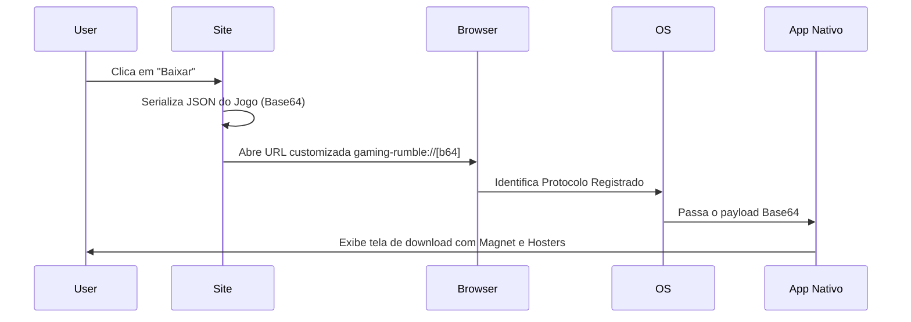

# 🎮 Gaming Rumble (GR-Link)

<p align="center">
  
</p>

<p align="center">
  
  
  
  
  
</p>

<br>

> O frontend definitivo para o ecossistema Gaming Rumble. Um catálogo de jogos de alto desempenho, focado em UX, com integração profunda via Deep Links, sincronização automatizada e API REST pública.

---

## 📋 Índice

- 🚀 [Recursos Principais](#-recursos-principais)
- 🔀 [Sistema de Rotas e Redirecionamento](#-sistema-de-rotas-e-redirecionamento)
- 🧱 [Arquitetura e Fluxo de Dados](#-arquitetura-e-fluxo-de-dados)
- 🌐 [API Pública](#-api-pública)
- 📡 [Protocolo gaming-rumble:// (Deep Link)](#-protocolo-gaming-rumble-deep-link)
- 🛠️ [Guia de Desenvolvimento](#️-guia-de-desenvolvimento)
- 🌍 [Hospedagem na Vercel](#-hospedagem-na-vercel)
- 📁 [Estrutura do Projeto](#-estrutura-do-projeto)
- 📜 [Licença](#-licença)

---

## 🚀 Recursos Principais

### 🖥️ Interface de Usuário (UI/UX)
- **Grid Ultra-Wide:** Otimizado para monitores de alta performance, exibindo até 10 jogos por linha em 4K.
- **Design "Glassmorphism":** Cabeçalho e rodapé com efeitos de desfoque (backdrop-blur) e transparência.
- **Barra de Status Inteligente:** Rodapé dinâmico com saúde do banco (`match_rate`), torrents, build e atalho direto para a documentação da API.
- **Badges de Status:** Identificadores visuais para jogos recém-adicionados (`NOVO`) e atualizados (`UPD`).

### 🔍 Exploração e Busca
- **Busca por Info Hash:** Permite colar o Hash do torrent diretamente na busca para localizar o jogo instantaneamente.
- **Ranking de Relevância:** Algoritmo de busca que prioriza correspondências exatas e prefixos sobre correspondências parciais.
- **Ordenação Inteligente:** Filtros por Data de Lançamento, Tamanho de Arquivo e Ordem Alfabética.

### 📦 Gestão de Downloads
- **Sistema Colapsável:** Modais limpos que escondem listas longas de arquivos ou múltiplos providers de download direto.
- **Normalização de Links:** Utilitário `ensureProtocol` que corrige URLs malformadas garantindo que o redirecionamento sempre funcione.
- **Deep Link Bridge:** Telas de espera que enriquecem os dados básicos com metadados do banco de dados (Tags, Banners HD).

### 🌐 API REST Pública
- **Explorer Interativo em `/api`:** Documentação estilo Swagger com design glassmorphism, modais "Try it" e download de coleção Postman dinâmica.
- **Rate Limiting por IP:** 60 req/min sem chave, 300 req/min com `X-Api-Key`, sem limite com `MASTER_API_KEY`.
- **Headers de Rate Limit:** `X-RateLimit-Limit`, `X-RateLimit-Remaining`, `X-RateLimit-Reset`, `Retry-After`.

---

## 🔀 Sistema de Rotas e Redirecionamento

| Rota | Descrição Técnica |
|---|---|
| `/page/:page` | Exibe o catálogo. Faz o "clamping" automático (ex: se pedir página 999, vai para a última disponível). |
| `/game/:id` | **Rota Dual:** Se `:id` for um slug (nome), abre o modal. Se for um Hash (40 chars), resolve o jogo e redireciona a URL para o slug. |
| `/game/:slug?download` | Gatilho silencioso: codifica os dados, envia para a bridge e abre o app nativo. |
| `/?data=<payload>` | Rota de processamento de Deep Link via parâmetro de busca. |
| `/d/:id` | Redirecionador curto amigável para uso em bots do Discord. |
| `/api` | Explorer interativo da API REST (documentação + Try it). |

---

## 🧱 Arquitetura e Fluxo de Dados

### Sincronização Serverless
O site não possui um banco de dados SQL tradicional. Ele utiliza o **Vercel Blob** como um armazenamento de objetos ultrarrápido, alimentado por um cron job.

1.  **Trigger:** Vercel Cron aciona `/api/cron` a cada 24h.
2.  **Ingestão:** A função serverless baixa o `online_fix_games.json` e o `stats.json` direto do repositório de dados no GitHub.
3.  **Processamento:** Os dados são validados e salvos no Blob Storage com `allowOverwrite: true`.
4.  **Consumo:** O cliente React usa `TanStack Query` para buscar os dados via `/api/games` e `/api/stats` (nunca diretamente do Blob — as URLs ficam server-side apenas).

### Arquitetura das Serverless Functions
Todas as rotas `/api/*` são consolidadas em **dois serverless functions** (dentro do limite Hobby da Vercel):
- `api/cron.ts` — sincronizador de dados (acionado pelo cron agendado)
- `api/[...path].ts` — router catch-all com toda a lógica da API REST

O padrão `createHandler` aplica CORS, autenticação via `X-Api-Key` e rate limiting automaticamente em todas as rotas.

### Diagrama de Sequência de Download


---

## 🌐 API Pública

Explorer interativo disponível em `/api` com design do site, modais "Try it" e download de coleção Postman.

### Autenticação e Rate Limiting

| Tipo | Header | Limite |
|---|---|---|
| Sem chave | — | 60 req/min |
| Com chave | `X-Api-Key: sua-chave` | 300 req/min |
| Master key | `X-Api-Key: MASTER_API_KEY` | Sem limite |

### Endpoints

#### `GET /api/manifest`
Metadados do ecossistema, versões de cliente suportadas e mapeamento de rotas.

#### `GET /api/health`
Integridade do ecossistema, tempo de atividade e latência de consulta à base de jogos.

#### `GET /api/stats`
Estatísticas detalhadas: total de jogos, torrents e última data de sincronização.

#### `GET /api/games`
Lista todos os jogos do catálogo.

#### `GET /api/games/:slug`
Retorna um jogo pelo slug (ex: `/api/games/cyberpunk-2077`).

#### `GET /api/games/hash/:hash`
Busca um jogo pelo Info Hash do torrent (ex: `/api/games/hash/<hash>`).

#### `GET /api/search?q=:termo`
Busca por título, hash, tags (gêneros/categorias Steam) ou providers (ex: `gofile`, `pixeldrain`).

#### `GET /api/trending`
12 jogos em alta (ordenados por novidade).

#### `GET /api/recent`
24 jogos recém-adicionados.

#### `GET /api/updated`
24 jogos atualizados recentemente.

#### `GET /api/providers`
Todos os providers de download disponíveis na base.

#### `GET /api/download/:slug`
Payload codificado para abrir no app nativo via `gaming-rumble://`.

#### `GET /api/d/:id`
Resolver de link curto para bots do Discord (aceita slug ou hash).

#### `GET /api/encode/:hashOrSlug`
Retorna a URL direta `gaming-rumble://<payload>` para um jogo.

#### `POST /api/encode`
Codifica dados customizados e retorna o payload Base64 + URL de protocolo.
```json
{
  "game": {
    "title": "Nome do Jogo",
    "magnet": "magnet:?xt=urn:btih:...",
    "fileSize": "10 GB",
    "files": []
  }
}
```

---

## 📡 Protocolo `gaming-rumble://` (Deep Link)

### Estrutura do Payload (V2)
```typescript
interface ProtocolPayload {
  title: string;      // Nome do jogo
  banner: string;     // URL da imagem de cabeçalho
  parts: number;      // Quantidade de arquivos/partes
  fileSize: string;   // Tamanho formatado (ex: "10 GB")
  magnet: string;     // Link magnet completo
  hash: string;       // Info Hash completo do torrent
  h?: {               // Opcional: Download Direto
    [provider: string]: Array<{ n: string; u: string }>
  }
}
```

---

## 🛠️ Guia de Desenvolvimento

### Stack Tecnológica
- **Framework:** React 18 com Vite (SWC)
- **Estilização:** Tailwind CSS + `tailwindcss-animate`
- **Estado Global/Server:** TanStack Query V5 (SWR pattern)
- **Utilidades:** `fflate` (compressão zlib no browser), `lucide-react` (ícones)

### Comandos Úteis
| Comando | Descrição |
|---|---|
| `bun dev` | Inicia o servidor Vite em `localhost:8080` (frontend apenas) |
| `bun run dev:full` | Inicia `vercel dev` com funções serverless em `localhost:3000` |
| `bun run build` | Gera a build otimizada na pasta `dist/` |
| `bun run lint` | Executa o ESLint |

> **Nota:** `bun run dev:full` requer a Vercel CLI instalada globalmente (`bun add -g vercel`) e o projeto linkado (`vercel link`).

---

## 🌍 Hospedagem na Vercel

### Pré-requisitos
1. Conta na Vercel (plano Hobby é suficiente — a API usa apenas 2 serverless functions)
2. Um Vercel Blob Storage criado no projeto
3. Fork/clone deste repositório

### Variáveis de Ambiente

Configure em **Settings → Environment Variables** na Vercel. Marque **Production**, **Preview** e **Development** para cada uma.

| Variável | Onde obter | Obrigatória |
|---|---|---|
| `VITE_GAMES_API_URL` | URL pública do arquivo `games.json` no seu Vercel Blob | ✅ |
| `VITE_STATS_API_URL` | URL pública do arquivo `stats.json` no seu Vercel Blob | ✅ |
| `BLOB_READ_WRITE_TOKEN` | Vercel → Storage → seu Blob → `.env.local` | ✅ |
| `CRON_SECRET` | Qualquer string aleatória longa (protege `/api/cron`) | ✅ |
| `API_KEYS` | Keys separadas por vírgula para dar 300 req/min a bots/apps | ⬜ |
| `MASTER_API_KEY` | String secreta longa — sem rate limit (para uso interno) | ⬜ |

### Como gerar valores seguros
```bash
# Gera uma string aleatória de 64 caracteres hexadecimais
openssl rand -hex 32
```

### Passos para hospedar

```bash
# 1. Instala a Vercel CLI
bun add -g vercel

# 2. Faz login
vercel login

# 3. Linka o projeto (na pasta do projeto)
vercel link

# 4. Puxa as env vars de produção para desenvolvimento local
vercel env pull --environment=production

# 5. Deploy manual (ou conecte o GitHub para deploy automático)
vercel --prod
```

### Configurar o Blob Storage
Após criar o Blob Storage na Vercel, execute o cron manualmente uma vez para popular os dados:
```bash
curl -X GET "https://seu-dominio.vercel.app/api/cron" \
  -H "Authorization: Bearer SEU_CRON_SECRET"
```

---

## 📁 Estrutura do Projeto

```txt
gr-link/
├── api/
│   ├── _utils.ts              # Helpers: fetchGames, sendJson, cors, createHandler (rate limiting)
│   ├── _games.ts              # Tipos e funções de negócio da API (server-side)
│   ├── cron.ts                # Sincronizador atômico (Games + Stats → Vercel Blob)
│   └── [...path].ts           # Router catch-all: todas as rotas /api/* em um único function
├── src/
│   ├── components/
│   │   ├── GameCatalog.tsx    # O "coração" do site (Grid, Header, Footer com link /api)
│   │   ├── GameModal.tsx      # Modal detalhado com lógica de colapso
│   │   └── ui/                # Primitivos de UI (Tooltip, Sonner, etc)
│   ├── lib/
│   │   ├── games.ts           # Business Logic, Sorting e Protocol Schema (browser)
│   │   └── translations.json  # Engine de tradução para requisitos
│   ├── pages/
│   │   ├── Index.tsx          # Landing/Bridge principal (?data=)
│   │   ├── ApiExplorer.tsx    # Explorer interativo da API (/api)
│   │   └── ShortLink.tsx      # Bridge para links curtos (/d/)
│   └── ...
├── vercel.json                # Agendamento de cron e regras de roteamento
└── ...
```

---

## 📜 Licença

Este software é fornecido "como está", para fins educacionais e de demonstração técnica.

Consulte o arquivo [LICENSE](LICENSE) para mais detalhes sobre permissões e restrições.

---
<p align="center">Feito com ❤️ pela comunidade Gaming Rumble</p>
