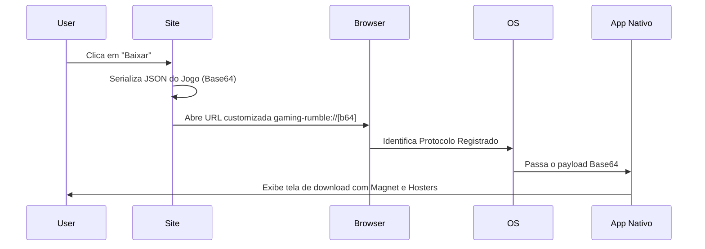

# 🎮 Gaming Rumble (GR-Link)

<p align="center">
  
</p>

<p align="center">
  
  
  
  
  
</p>

<br>

> O frontend definitivo para o ecossistema Gaming Rumble. Um catálogo de jogos de alto desempenho, focado em UX, com integração profunda via Deep Links e sincronização automatizada.

---

## 📋 Índice

- 🚀 [Recursos Principais](#-recursos-principais)
- 🔀 [Sistema de Rotas e Redirecionamento](#-sistema-de-rotas-e-redirecionamento)
- 🧱 [Arquitetura e Fluxo de Dados](#-arquitetura-e-fluxo-de-dados)
- 📡 [Protocolo gaming-rumble:// (Deep Link)](#-protocolo-gaming-rumble-deep-link)
- 🛠️ [Guia de Desenvolvimento](#️-guia-de-desenvolvimento)
- 🌍 [Variáveis de Ambiente](#-variáveis-de-ambiente)
- 📁 [Estrutura do Projeto](#-estrutura-do-projeto)
- 📜 [Licença](#-licença)

---

## 🚀 Recursos Principais

### 🖥️ Interface de Usuário (UI/UX)
- **Grid Ultra-Wide:** Otimizado para monitores de alta performance, exibindo até 10 jogos por linha em 4K.
- **Design "Glassmorphism":** Cabeçalho e rodapé com efeitos de desfoque (backdrop-blur) e transparência.
- **Barra de Status Inteligente:** Rodapé dinâmico que exibe saúde do banco (`match_rate`), total de torrents e build, com animação de auto-hide para não obstruir a navegação.
- **Badges de Status:** Identificadores visuais para jogos recém-adicionados (`NOVO`) e atualizados (`UPD`).

### 🔍 Exploração e Busca
- **Busca por Info Hash:** Permite colar o Hash do torrent diretamente na busca para localizar o jogo instantaneamente.
- **Ranking de Relevância:** Algoritmo de busca que prioriza correspondências exatas e prefixos sobre correspondências parciais.
- **Ordenação Inteligente:** Filtros por Data de Lançamento, Tamanho de Arquivo e Ordem Alfabética.

### 📦 Gestão de Downloads
- **Sistema Colapsável:** Modais limpos que escondem listas longas de arquivos ou múltiplos providers de download direto.
- **Normalização de Links:** Utilitário `ensureProtocol` que corrige URLs malformadas garantindo que o redirecionamento sempre funcione.
- **Deep Link Bridge:** Telas de espera que enriquecem os dados básicos com metadados do banco de dados (Tags, Banners HD).

---

## 🔀 Sistema de Rotas e Redirecionamento

O site utiliza o `react-router-dom` para gerenciar um fluxo de navegação híbrido:

| Rota | Descrição Técnica |
|---|---|
| `/page/:page` | Exibe o catálogo. Faz o "clamping" automático (ex: se pedir página 999, vai para a última disponível). |
| `/game/:id` | **Rota Dual:** Se `:id` for um slug (nome), abre o modal. Se for um Hash (40 chars), resolve o jogo e redireciona a URL para o slug. |
| `/game/:slug?download` | Gatilho silencioso: codifica os dados, envia para a bridge e abre o app nativo. |
| `/?data=<payload>` | Rota de processamento de Deep Link via parâmetro de busca. |
| `/d/:id` | Redirecionador curto amigável para uso em bots do Discord. |

---

## 🧱 Arquitetura e Fluxo de Dados

### Sincronização Serverless
O site não possui um banco de dados SQL tradicional. Ele utiliza o **Vercel Blob** como um armazenamento de objetos ultrarrápido, alimentado por um cron job.

1.  **Trigger:** Vercel Cron aciona `/api/cron` a cada 24h.
2.  **Ingestão:** A função serverless baixa o `online_fix_games.json` e o `stats.json` direto do repositório de dados no GitHub.
3.  **Processamento:** Os dados são validados e salvos no Blob Storage com `allowOverwrite: true`.
4.  **Consumo:** O cliente React usa `TanStack Query` para buscar esses arquivos, aplicando uma camada de cache de 5 minutos e **Cache-Busting** (`?t=...`) para ignorar caches de CDN.

### Diagrama de Sequência de Download


---

## 📡 Protocolo `gaming-rumble://` (Deep Link)

### Estrutura do Payload (V2)
O payload enviado ao app nativo é um objeto JSON codificado em Base64 URL-safe.

```typescript
interface ProtocolPayload {
  title: string;      // Nome do jogo
  banner: string;     // URL da imagem de cabeçalho
  parts: number;      // Quantidade de arquivos/partes
  fileSize: string;   // Tamanho formatado (ex: "10 GB")
  magnet: string;     // Link magnet completo
  hash: string;       // Info Hash completo do torrent
  h?: {               // Opcional: Download Direto
    [provider: string]: Array<{
      n: string;      // Nome do arquivo
      u: string;      // URL direta
    }>
  }
}
```

### Exemplo de Implementação (Site)
```javascript
const json = JSON.stringify(payload);
// Unescape/Encode garante suporte a caracteres UTF-8 (acentos, etc)
const b64 = btoa(unescape(encodeURIComponent(json)));
window.location.href = `gaming-rumble://${b64}`;
```

---

## 🌐 API Pública

O site expõe uma API REST pública e rápida para que bots (como Discord) e outros aplicativos possam consumir o catálogo de jogos do **Gaming Rumble**.

### Endpoints Disponíveis

#### `GET /api/manifest`
Retorna metadados do ecossistema, versões de cliente suportadas e mapeamento de rotas.

#### `GET /api/health`
Retorna a integridade do ecossistema, tempo de atividade e latência de consulta à base de jogos.

#### `GET /api/stats`
Retorna estatísticas detalhadas como quantidade total de jogos, torrents e última data de sincronização.

#### `GET /api/games`
Lista todos os jogos cadastrados no catálogo.

#### `GET /api/games/:slug`
Retorna informações detalhadas de um jogo específico buscando pelo slug (ex: `/api/games/cyberpunk-2077`).

#### `GET /api/games/hash/:hash`
Busca um jogo a partir do Info Hash do torrent (ex: `/api/games/hash/<hash>`).

#### `GET /api/search?q=:termo`
Busca jogos por título, hash, tags (gêneros e categorias Steam) ou providers de download (ex: `gofile`, `pixeldrain`).

#### `GET /api/trending`
Retorna uma lista contendo os 12 jogos em alta (ordenados por novidade).

#### `GET /api/recent`
Retorna a lista dos 24 jogos recém-adicionados.

#### `GET /api/updated`
Retorna a lista dos 24 jogos atualizados recentemente.

#### `GET /api/providers`
Retorna todos os providers de download disponíveis na base de dados (ex: `torrent`, `gofile`, `pixeldrain`).

#### `GET /api/download/:slug`
Retorna o payload codificado para abrir diretamente no app nativo via `gaming-rumble://` e os links da bridge.

#### `GET /api/d/:id`
Busca e retorna o jogo correspondente a um ID curto (útil para links curtos e bots).

#### `GET /api/encode/:hashOrSlug`
Busca o jogo e retorna a URL direta de inicialização do protocolo nativo `gaming-rumble://<payload>`.

#### `POST /api/encode`
Recebe dados de um jogo customizado no corpo da requisição e retorna o payload Base64 URL-safe junto com a URL de protocolo.
- **Corpo (JSON):**
  ```json
  {
    "game": {
      "title": "Nome do Jogo",
      "magnet": "magnet:?xt=urn:btih:...",
      "fileSize": "10 GB",
      "files": []
    }
  }
  ```

---

## 🛠️ Guia de Desenvolvimento

### Stack Tecnológica
- **Framework:** React 18 com Vite (SWC)
- **Estilização:** Tailwind CSS + `tailwindcss-animate`
- **Estado Global/Server:** TanStack Query V5 (SWR pattern)
- **Utilidades:** `fflate` (compressão zlib), `lucide-react` (ícones)

### Comandos Úteis
| Comando | Descrição |
|---|---|
| `bun dev` | Inicia o servidor de desenvolvimento em `localhost:8080` |
| `bun run build` | Gera a build otimizada na pasta `dist/` |
| `bun run lint` | Executa o ESLint para verificar padrões de código |
| `bun run tsc` | Executa a verificação de tipos do TypeScript |

---

## 🌍 Variáveis de Ambiente

Configuradas no dashboard da Vercel em **Settings → Environment Variables**. Nunca commitar valores reais no repositório.

```env
# URL do Blob Storage (server-side only, não exposta ao cliente)
VITE_GAMES_API_URL=<sua-url-privada>/games.json
VITE_STATS_API_URL=<sua-url-privada>/stats.json

# Token de escrita do Vercel Blob (cron sync)
BLOB_READ_WRITE_TOKEN=vercel_blob_rw_...

# Autenticação do cron job
CRON_SECRET=<secret>

# Chaves de API (separadas por vírgula) — 300 req/min
API_KEYS=key1,key2

# Master key — sem rate limit
MASTER_API_KEY=<secret-longo>
```

---

## 📁 Estrutura do Projeto

```txt
gr-link/
├── api/
│   ├── _utils.ts              # Helpers: fetchGames, sendJson, cors, getPathParam
│   ├── cron.ts                # Sincronizador atômico (Games + Stats → Vercel Blob)
│   ├── health.ts              # GET /api/health — status, latência, gamesCount
│   ├── manifest.ts            # GET /api/manifest — versão, protocolo, endpoints
│   ├── stats.ts               # GET /api/stats — totais e última sync
│   ├── search.ts              # GET /api/search?q= — busca por nome, hash, provider, tag
│   ├── trending.ts            # GET /api/trending — 12 jogos mais recentes
│   ├── recent.ts              # GET /api/recent — 24 recém-adicionados
│   ├── updated.ts             # GET /api/updated — 24 atualizados recentemente
│   ├── providers.ts           # GET /api/providers — lista providers disponíveis
│   ├── games/
│   │   ├── index.ts           # GET /api/games — todos os jogos
│   │   ├── [slug].ts          # GET /api/games/:slug — jogo por slug
│   │   └── hash/
│   │       └── [hash].ts      # GET /api/games/hash/:hash — jogo por info hash
│   ├── download/
│   │   └── [slug].ts          # GET /api/download/:slug — payload gaming-rumble://
│   ├── encode/
│   │   ├── index.ts           # POST /api/encode — codifica payload customizado
│   │   └── [hashOrSlug].ts    # GET /api/encode/:hashOrSlug — URL gaming-rumble:// direta
│   └── d/
│       └── [id].ts            # GET /api/d/:id — resolver link curto (Discord bot)
├── src/
│   ├── components/
│   │   ├── GameCatalog.tsx    # O "coração" do site (Grid, Header, Footer)
│   │   ├── GameModal.tsx      # Modal detalhado com lógica de colapso
│   │   └── ui/                # Primitivos de UI (Tooltip, Sonner, etc)
│   ├── lib/
│   │   ├── games.ts           # Business Logic, Sorting e Protocol Schema
│   │   └── translations.json  # Engine de tradução para requisitos
│   ├── pages/
│   │   ├── Index.tsx          # Landing/Bridge principal (?data=)
│   │   └── ShortLink.tsx      # Bridge para links curtos (/d/)
│   └── ...
├── vercel.json                # Agendamento de cron e regras de SPA
└── ...
```

---

## 📜 Licença

Este software é fornecido "como está", para fins educacionais e de demonstração técnica.

Consulte o arquivo [LICENSE](LICENSE) para mais detalhes sobre permissões e restrições.

---
<p align="center">Feito com ❤️ pela comunidade Gaming Rumble</p>
