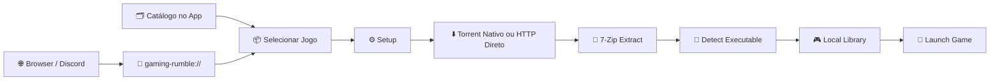
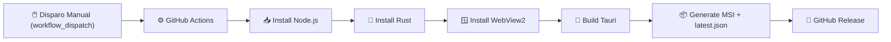

# 🎮 Gaming Rumble (Desktop Client)

<p align="center">
  
</p>

<br>

> Cliente desktop construído com Tauri para navegar um catálogo de jogos, baixar via torrent nativo ou HTTP direto, extrair automaticamente e organizar a biblioteca local no Windows.

## ✨ Snapshot Do Projeto

| Plataforma | Engine | Frontend | Runtime | Status |
|:---:|:---:|:---:|:---:|:---:|
|  |  |  |  |  |

---

## 📋 Índice

<details open>
<summary><b>Clique para expandir/recolher</b></summary>

- 📖 [Sobre o Projeto](#-sobre-o-projeto)
- ⚠️ [Compatibilidade](#️-compatibilidade)
- 🧭 [Fluxo Completo Do Produto](#-fluxo-completo-do-produto)
- ✨ [Recursos Principais](#-recursos-principais)
- 🧠 [Como O Fluxo Funciona](#-como-o-fluxo-funciona)
- 🧱 [Stack Atual](#-stack-atual)
- 📦 [Binários Externos](#-binários-externos)
- 🖥️ [Plataforma Suportada](#️-plataforma-suportada)
- 🗂️ [Estrutura Do Projeto](#️-estrutura-do-projeto)
- ⚙️ [Configuração Local](#️-configuração-local)
- 🚀 [Desenvolvimento](#-desenvolvimento)
- 📦 [Build E Release](#-build-e-release)
- 🧠 [Comportamentos Técnicos](#-comportamentos-técnicos)
- 🛠️ [Notas Operacionais](#️-notas-operacionais)
- ⚠️ [Aviso Legal](#️-aviso-legal)
- 📜 [Licença](#-licença)

</details>

---

## 📖 Sobre o Projeto

O Gaming Rumble é o client desktop principal do ecossistema.

Ele automatiza todo o fluxo de descoberta e instalação dos jogos:

- Catálogo navegável com busca, ordenação e paginação, sincronizado com metadados da Steam
- Também recebe payloads via protocolo `gaming-rumble://` (deep-link)
- Executa downloads via BitTorrent com motor nativo embutido (`librqbit`)
- Baixa direto via HTTP (ex.: Pixeldrain) quando o hoster oferece o jogo (e o fix) sem torrent
- Extrai automaticamente os arquivos do jogo
- Detecta executáveis principais
- Organiza a biblioteca local com persistência em `SQLite`
- Cria atalhos automaticamente
- Monitora sessões iniciadas pelo launcher
- Mantém gerenciamento persistente da biblioteca
- Importa automaticamente bibliotecas legadas em `JSON` no primeiro boot compatível e finaliza a transição para `SQLite`

O foco do projeto é reduzir atrito e automatizar processos repetitivos.

---

## ⚠️ Compatibilidade

> [!WARNING]
> Este client foi desenvolvido especificamente para o ecossistema Gaming Rumble.
>
> Atualmente o fluxo suportado é baseado no indexador vindo de `online-fix.me`.
>
> Magnet links aleatórios ou payloads externos podem não funcionar corretamente.
>
> Não existe garantia de compatibilidade fora do fluxo oficial do projeto.

---

## 🧭 Fluxo Completo Do Produto


```mermaid
flowchart LR
  A1["🗂️ Catálogo no App"] --> C["📦 Selecionar Jogo"]
  A2["🌐 Browser / Discord"] --> B["🚀 gaming-rumble://"]
  B --> C
  C --> D["⚙️ Setup"]
  D --> E["⬇️ Torrent Nativo ou HTTP Direto"]
  E --> F["📂 7-Zip Extract"]
  F --> G["🧠 Detect Executable"]
  G --> H["🎮 Local Library"]
  H --> I["🚀 Launch Game"]
```

---

## ✨ Recursos Principais

| Feature | Descrição |
|---|---|
| Catálogo In-App | Busca, ordenação e paginação responsiva, com sincronização de metadados da Steam |
| Detalhes do Jogo | Modal com trailers (player HLS), screenshots, conquistas, requisitos e avaliações |
| `gaming-rumble://` | Protocolo customizado para instalação automática via deep-link |
| Download BitTorrent Nativo | Motor embutido (`librqbit`), sem binário externo, com progresso em tempo real |
| Download HTTP Direto | Baixa via Pixeldrain (jogo + fix) quando disponível, sem precisar de torrent |
| Biblioteca Persistente | Jogos instalados ficam registrados localmente em `SQLite` |
| Auto Extract | Extração automática pós-download |
| Fix Only | Baixa apenas o fix quando necessário, via torrent ou HTTP direto |
| Auto Shortcut | Cria atalhos automaticamente |
| System Tray | Fecha para tray e restaura o launcher rapidamente |
| Playtime Tracking | Monitora tempo jogado das sessões iniciadas pelo app |
| Resume Support | Pausa e retomada de download |
| Disk Validation | Verifica espaço disponível antes da instalação |
| Error Handling | Tratamento separado para download e extração |
| Executable Detection | Detecta automaticamente o executável principal |

---

## 🧠 Como O Fluxo Funciona

### Catálogo

O jeito principal de instalar um jogo hoje é navegando pelo Catálogo dentro do próprio app: buscar, ver detalhes (trailers, screenshots, conquistas) e clicar em instalar. O launcher escolhe automaticamente entre download HTTP direto (quando um hoster como o Pixeldrain tem o jogo completo) e torrent.

### Payload (deep-link)

O fluxo antigo via Discord/navegador continua funcionando: o navegador ou app intermediário envia um payload Base64:

```json
{
  "title": "Nome do Jogo",
  "banner": "https://shared.akamai.steamstatic.com/.../header.jpg",
  "parts": 4,
  "fileSize": "551.10 MB",
  "magnet": "magnet:?xt=urn:btih:..."
}
```

### Fluxo interno

```txt
1. Usuário escolhe um jogo no Catálogo (ou abre gaming-rumble://)
2. Payload é resolvido (catálogo local ou deep-link decodificado)
3. Usuário confirma instalação
4. Motor nativo de torrent ou download HTTP direto inicia
5. 7-Zip extrai os arquivos
6. O executável principal é detectado
7. O jogo entra na biblioteca
8. Atalhos são criados automaticamente
```

---

## 🧱 Stack Atual

### Base do projeto

<table align="center">
  <tr>
    <td align="center">
      <br>
      <strong>React 19</strong>
    </td>
    <td align="center">
      <br>
      <strong>TypeScript</strong>
    </td>
    <td align="center">
      <br>
      <strong>Tauri 2</strong>
    </td>
    <td align="center">
      <br>
      <strong>Tailwind 4</strong>
    </td>
    <td align="center">
      <br>
      <strong>Rust</strong>
    </td>
    <td align="center">
      <br>
      <strong>SQLite</strong>
    </td>
    <td align="center">
      <br>
      <strong>Prisma</strong>
    </td>
  </tr>
</table>

---

## 📦 Binários Externos

| Binário | Status | Finalidade |
|---|---|---|
| `7-ZIP/` | Bundled | Extração de arquivos |
| `WebView2` | Runtime | Renderização da UI |

> O motor de torrent (`librqbit`) e o de download HTTP direto rodam embutidos no processo Rust — não há mais binário externo de download baixado ou empacotado.

---

## 🖥️ Plataforma Suportada

| Sistema | Status |
|---|---|
| Windows 10 | ✅ Suportado |
| Windows 11 | ✅ Suportado |
| Linux | ❌ Não suportado oficialmente |
| macOS | ❌ Não suportado oficialmente |

> O projeto atual foi desenvolvido e empacotado exclusivamente com foco em Windows.

---

## 🗂️ Estrutura Do Projeto

```txt
Gaming Rumble/
├── prisma/
│   ├── migrations/
│   └── schema.prisma
├── src/
│   ├── domain/           # Tipos e regras de negócio puras
│   ├── application/      # Hooks de orquestração (use-cases)
│   ├── infrastructure/   # Comandos/eventos Tauri, storage local
│   └── presentation/     # Componentes React (catalog, library, shell, settings...)
├── src-tauri/
│   ├── src/
│   │   ├── commands/     # Wrappers finos dos comandos Tauri
│   │   └── services/     # Lógica real (catalog, torrent, http_download, library...)
│   └── tauri.conf.json
├── public/
├── .github/workflows/
└── README.md
```

### Visão rápida das pastas

| Caminho | Conteúdo |
|---|---|
| `src/domain/` | Modelos e regras puras (catálogo, download, hosters) |
| `src/application/` | Hooks que orquestram estado e chamadas ao backend |
| `src/infrastructure/` | Bindings de comandos/eventos do Tauri e storage local |
| `src/presentation/` | Telas e componentes React |
| `src-tauri/src/commands/` | Comandos nativos expostos ao frontend |
| `src-tauri/src/services/` | Implementação real de cada domínio no Rust |
| `prisma/` | Schema e migrações da biblioteca local |
| `tauri.conf.json` | Configuração principal |
| `.github/workflows/` | Build e release CI/CD |

---

## ⚙️ Configuração Local

### Pré-requisitos

| Ferramenta | Necessária |
|---|---|
| Node.js LTS | Sim |
| Rust / rustup | Sim |
| Windows 10/11 | Sim |

---

## 🚀 Desenvolvimento

### Instalar dependências

```bash
npm install
npm run prisma:generate
```

### Rodar ambiente local

```bash
npm run tauri dev
```

### Gerar build local

```bash
npm run tauri build
```

---

## 📦 Build E Release

### Saídas locais

Os builds são gerados em:

```txt
src-tauri/target/release/bundle/msi/
src-tauri/target/release/bundle/nsis/
```

### Pipeline CI/CD


```mermaid
flowchart LR
  A["🖱️ Disparo Manual (workflow_dispatch)"] --> B["⚙️ GitHub Actions"]
  B --> C["📥 Install Node.js"]
  C --> D["🦀 Install Rust"]
  D --> E["🪟 Install WebView2"]
  E --> F["🔨 Build Tauri"]
  F --> G["📦 Generate MSI + latest.json"]
  G --> H["🚀 GitHub Release"]
```

O workflow é disparado manualmente (não roda mais a cada push na `main`) e automatiza:

- instalação do ambiente
- geração dos bundles (MSI e NSIS localmente)
- publicação apenas do instalador `.msi` e do `latest.json` do updater
- criação de releases

---

## 🧠 Comportamentos Técnicos

| Sistema | Função |
|---|---|
| Catalog Sync | Busca e cacheia o catálogo remoto, com estatísticas de correspondência |
| Download State | Persistência local de progresso |
| Event System | Eventos Tauri para logs e progresso |
| Library Manager | Gerenciamento local da biblioteca em `SQLite`, com reconciliação de pastas órfãs |
| Extract Pipeline | Pipeline separada de extração |
| Launcher Detection | Busca automática do executável |
| Tray Runtime | Minimização para tray e restauração do launcher |
| Session Tracking | Monitoramento de processo e tempo jogado |

---

## 🛠️ Notas Operacionais

- O app utiliza janela customizada sem decoração nativa, redimensionável (mínimo 1024x680)
- O botão de fechar envia o launcher para o tray em vez de encerrar imediatamente
- O estado dos downloads sobrevive a reload durante desenvolvimento
- O motor de torrent é nativo (`librqbit`, embutido no processo) — não há mais download de binário externo na primeira execução
- A biblioteca é mantida localmente pelo client com banco `SQLite`
- Pastas parciais de downloads cancelados/falhos são limpas e nunca são reconciliadas como jogos instalados
- Bibliotecas antigas em `library.json` são migradas automaticamente uma única vez quando encontradas e depois deixam de ser usadas
- O fluxo foi desenhado para integração com o ecossistema Gaming Rumble
- O projeto não pretende ser um client torrent genérico

---

## ⚠️ Aviso Legal

> [!WARNING]
> Este software é fornecido **"AS IS"**, sem garantias de qualquer tipo.
>
> - O projeto não hospeda conteúdo protegido
> - O app apenas automatiza download, extração e gerenciamento
> - Não existe suporte para conteúdo acessado pelo usuário
> - O uso é por conta e risco do usuário final
> - Toda responsabilidade sobre conteúdo acessado pertence ao usuário

---

## 📜 Licença

Este repositório é disponibilizado apenas para fins educacionais e de pesquisa.

Veja a licença completa e o aviso legal em `LICENSE`.
